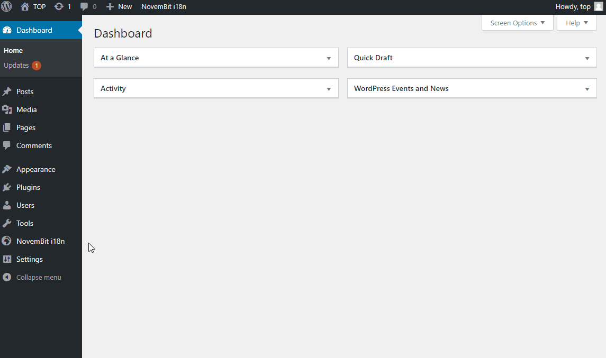

# Wordpress NovemBit i18n internationalization plugin

## How to install

1. Go to plugins directory `/wp-content/plugins`
2. Clone git repo
    ```bash
    git clone https://github.com/NovemBit/novembit-i18n 
    ```
3. Run composer update command
    ```bash
    composer update
    ```
4. Then activate plugin from admin plugins page or run wp-cli command
    ```bash
    wp plugin activate novembit-i18n
    ```
   
## How to start
> Setup plugin.


